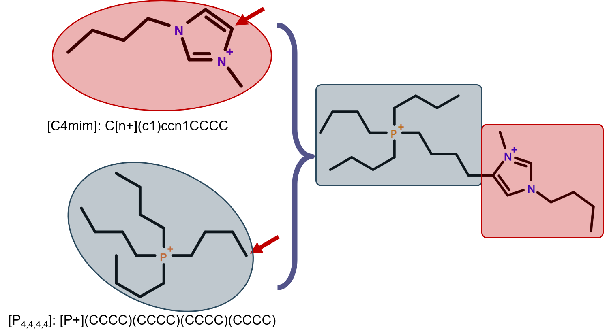

# MARS+: Molecular Assembly and Representation Suite - Plus

## The old MARS

In computer-aided molecular design (CAMD) [1][2], the capability of generating new molecular species from existing one is vital. [MARS program](https://github.com/hsuhsuanhao/MARS) [3] is devised for such demand. It consists of two components: 

* **Molecular data structure (MDS):** Base elements and 5 arrays of integers
* **Genetic operators:** ring formation, addition, subtraction, exchange, crossover, and combination

To initiate a MARS task, one should input the 3D structures of the starting molecules. These structures will then be converted into MDS representation, where a structure is recognized as a network of base elements. Each of the genetic operators will be applied to each of the possible substructures in each of the MDSs. As a result, a number of new species can be generated.  

## What's new in MARS+?

MARS+ is based on the prototype of MARS [3], with various improvements:

1. **The expansion of base element library**

        1-1. Group-like elements are allowed now.
        1-2. Common neutral atoms, ionic cores, and anionic cores are included.

2. **The generalization of MDS**

		2-1. An extra array of integers is used to bookkeep atomic chirality.
		2-2. Two extra arrays of integers are used to bookkeep cis-trans isomerism.
		2-3. An extra array of integers is used to bookkeep cyclic bonds.
		2-4. Multiple ring numbers on an atom are allowed now.
		2-5. The representation of 2-component chemical is allowed now. (1:1 ILs are demonstrated here)

3. **The generalization of genetic opertors**

		3-1. Refinement of old operators:
			 3-1-1. The feasibility of molecular connectivity is ensured after subtraction.
			 3-1-2. Multiple ring numbers on an atom can happen through cyclization operator.
			 3-1-3. Most of them are greatly revised using a more consistent approach.
			 3-1-4. The stability and flexibility are greatly enhanced. 
		3-2. Development of new operators: insertion, decyclization, element change, cis-trans inversion, chirality inversion, and component switch.
		3-3. With better reversibility for the new scheme of operators, undoing an operator is easier. This reduces the bias to certain types of molecules (e.g. polycyclics).
		3-4. Check cis-trans and chirality after genetic operations. (default: trans and clockwise winding)
		3-5. For imine substructure, indicate the lone pair of nitrogen atom by null atom "*".

4. **Wrapping Open Babel [4] functions into MARS+**

		4-1. This facilitates the inputting of starting structures to the program. Now one only needs to input SMILES.
		4-2. The perception for connectivity of inputted molecules are more robust.

## Development environment

* Linux CentOS 7
* GNU g++ compiler v9.2.0  (C++11)
* Open Babel v3.1.0 
* Eigen v3.3.7
* Cmake v3.15.5 
* Make v4.2 

## Compiling 

The MARS+ source code consists of 7 header files and 7 cpp files: (see `./src/` directory)

    ELEMENTS.h    MOLECULE.h    CASES_NEU.h    CASES_IL_INDEPENDENT.h    CASES_IL.h    UTILITY.h    PARAMETER.h
    ELEMENTS.cpp  MOLECULE.cpp  CASES_NEU.cpp  CASES_IL_INDEPENDENT.cpp  CASES_IL.cpp  UTILITY.cpp  main.cpp 
    
Before compiling, relevant softwares should be installed. For simplicity, it is recommended to get them through [Miniconda](https://docs.conda.io/en/latest/miniconda.html) or [Anaconda](https://www.anaconda.com/download). If conda is available, one can directly creates `MARS+` environment and imports the necessary packages from the provided YML file.

    conda env create --file ./MARS+_env.yml
    
Now activate the `MARS+` environment and compile. 

    conda activate MARS+
    cd ./src
    rm -r ./cmake_install.cmake ./CMakeFiles/ ./CMakeCache.txt 2> /dev/null
    cmake ./CMakeLists.txt
    make -j [N]                 ("-j [N]" is optional. Parallel compiling with N jobs at once)

An executable file `MARS-PLUS` will be generated in `./src/`.

## Usage

There are several input files for MARS+: (see `./INPUTS/` directory)
        
    ./INPUTS/control.in                     : controls the input, output, and calculation options.
    ./INPUTS/ELEMENT_LISTS/element_list.txt : a list that defines base element library.
    ./INPUTS/INPUT_CHEMICALS/IL4.txt        : the starting chemicals.
    
Please read the instructions in `./INPUTS/control.in` and `./INPUTS/ELEMENT_LISTS/element_list.txt`.
Make sure you have properly set the parameters. Now launch the MARS+:

	conda activate MARS+
	cd ./src/
	./MARS-PLUS ./INPUTS/control.in

Alternatively, you may use PBS scheduler if available.

	cd ./src/
	qsub ./job.sh

The results for each of the operations will be outputted as a file (see `./LOG_FILES/` directory).
For example, the results of bond change operation on an IL will be outputted to `./LOG_FILES/change_bnd_IL.txt`.

## Developers

Chen-Hsuan Huang (f07524028@ntu.edu.tw) and Shiang-Tai Lin (stlin@ntu.edu.tw).

Department of Chemical Engineering, National Taiwan University, Taipei, Taiwan

## References

[1] Austin, N. D.; Sahinidis, N. V.; Trahan, D. W., Computer-aided molecular design: An introduction and review of tools, applications, and solution techniques. Chem. Eng. Res. Des. 2016, 116, 2-26.

[2] Hsu, H. H.; Huang, C. H.; Lin, S. T., Fully Automated Molecular Design with Atomic Resolution for Desired Thermophysical Properties. Ind. Eng. Chem. Res. 2018, 57, (29), 9683-9692.

[3] Hsu, H.-H.; Huang, C.-H.; Lin, S.-T., New Data Structure for Computational Molecular Design with Atomic or Fragment Resolution. J. Chem. Inf. Model. 2019, 59, (9), 3703-3713.
(https://github.com/hsuhsuanhao/MARS)

[4] O’Boyle, N. M.; Banck, M.; James, C. A.; Morley, C.; Vandermeersch, T.; Hutchison, G. R., Open Babel: An open chemical toolbox. J. Cheminf. 2011. (https://github.com/openbabel/openbabel)

## Base elements

* Neutral elements

| ID   | Name (SMILES representation) | Bond order | charge |
| ---- | ---------------------------- | ---------- | ------ |
| 1    | \[CH0\](-)(-)(-)(-)          | 1 1 1 1    | 0      |
| 2    | C(=)(-)(-)                   | 2 1 1      | 0      |
| 3    | C(#)(-)                      | 3 1        | 0      |
| 4    | C(=)(=)                      | 2 2        | 0      |
| 5    | O(-)(-)                      | 1 1        | 0      |
| 6    | O(=)                         | 2          | 0      |
| 7    | N(-)(-)(-)                   | 1 1 1      | 0      |
| 8    | N(=)(-)                      | 2 1        | 0      |
| 9    | N(#)                         | 3          | 0      |
| 10   | O(-)                         | 1          | 0      |
| 11   | F(-)                         | 1          | 0      |
| 12   | Cl(-)                        | 1          | 0      |
| 13   | Br(-)                        | 1          | 0      |
| 14   | I(-)                         | 1          | 0      |
| 19   | S(-)(-)                      | 1 1        | 0      |
| 20   | S(=)                         | 2          | 0      |
| 21   | P(-)(-)(-)                   | 1 1 1      | 0      |
| 22   | P(=)(-)                      | 2 1        | 0      |
| 23   | P(#)                         | 3          | 0      |
| 31   | \[PH0\](-)(-)(-)(-)(-)       | 1 1 1 1 1  | 0      |
| 32   | \[PH0\](=)(-)(-)(-)          | 2 1 1 1    | 0      |
| 34   | S(=)(-)(-)                   | 1 1        | 0      |
| 61   | \[SH0\](=)(=)(-)(-)          | 2 2 1 1    | 0      |
| 62   | Cl(=)(=)(=)(-)               | 2 2 2 1    | 0      |
| 66   | P(=)(-)(-)                   | 2 1 1      | 0      |
| 67   | \[CH0@@\](-)(-)(-)(-)        | 1 1 1 1    | 0      |
| 68   | \[CH0@\](-)(-)(-)(-)         | 1 1 1 1    | 0      |
| 69   | \[PH0\](-)(-)(-)(-)          | 1 1 1 1    | 0      |
| 70   | *(-)                         | 1          | 0      |

* Cationic elements

| ID   |        Name (SMILES representation)      | Bond order | charge |
| ---- | ---------------------------------------- | ---------- | ------ |
| 15   | \[NH0+\](-)(-)(-)(-)                     | 1 1 1 1    | 1      |
| 16   | \[NH0+\](=)(-)(-)                        | 2 1 1      | 1      |
| 17   | \[PH0+\](-)(-)(-)(-)                     | 1 1 1 1    | 1      |
| 18   | \[PH0+\](=)(-)(-)                        | 2 1 1      | 1      |
| 36   | \[CH0\](-)(-)(-)(\[N+\]1C=CN(C)C=1)      | 1 1 1      | 1      |
| 37   | \[CH0\](-)(-)(-)(\[N+\]1C=CN(C)C(C)=1)   | 1 1 1      | 1      |
| 38   | \[CH0\](-)(-)(-)(N1C=C\[N+\](C)=C1)      | 1 1 1      | 1      |
| 39   | \[CH0\](-)(-)(-)(\[N+\]1=CC=CC(C)=C1)    | 1 1 1      | 1      |
| 40   | \[CH0\](-)(-)(-)(C1=C\[N+\](C)=CC=C1)    | 1 1 1      | 1      |
| 41   | C(-)(1=\[NH+\]C=CC=C1)                   | 1          | 1      |
| 42   | \[NH0+\](-)(1=CC=CC=C1)                  | 1          | 1      |
| 57   | \[In+3\](-)(-)(-)(-)                     | 1 1 1 1    | 3      |
| 64   | \[Ga+3\](-)(-)(-)(-)                     | 1 1 1 1    | 3      |
| 65   | \[SH0+\](-)(-)(-)                        | 1 1 1      | 1      |

* Anionic elements

| ID   |        Name (SMILES representation)      | Bond order | charge |
| ---- | ---------------------------------------- | ---------- | ------ |
| 24   | \[F-\]                                                                          | 0             | -1   |
| 25   | \[Cl-\]                                                                         | 0             | -1   |
| 26   | \[Br-\]                                                                         | 0             | -1   |
| 27   | \[I-\]                                                                          | 0             | -1   |
| 28   | \[OH1-\]                                                                        | 0             | -1   |
| 29   | \[OH0-\](-)                                                                     | 1             | -1   |
| 30   | \[PH0-\](-)(-)(-)(-)(-)(-)                                                      | 1 1 1 1 1 1   | -1   |
| 33   | S(-)(=O)(=O)(\[O-\])                                                            | 1             | -1   |
| 35   | \[NH0-\](-)(-)                                                                  | 1 1           | -1   |
| 43   | \[NH0-\](S(=O)(=O)C(F)(F)(F))(S(=O)(=O)C(F)(F)(F))                              | 0             | -1   |
| 44   | \[BH0-\](-)(-)(-)(-)                                                            | 1 1 1 1       | -1   |
| 45   | C(-)(-)(-)(C(=O)(\[O-\]))                                                       | 1 1 1         | -1   |
| 46   | C(#N)(\[S-\])                                                                   | 0             | -1   |
| 47   | C(-)(-)(-)(OP(=O)(OC)(\[O-\]))                                                  | 1 1 1         | -1   |
| 48   | C(#N)(\[N-\]C#N)                                                                | 0             | -1   |
| 49   | \[BH0-\](C#N)(C#N)(C#N)(C#N)                                                    | 0             | -1   |
| 50   | S(OCCOCCOC)(=O)(=O)(\[O-\])                                                     | 0             | -1   |
| 51   | S(c(cc1)ccc1C)(=O)(=O)(\[O-\])                                                  | 0             | -1   |
| 52   | \[PH0-\](F)(F)(F)(C(C(F)(F)F)(F)F)(C(C(F)(F)F)(F)F)(C(C(F)(F)F)(F)F)            | 0             | -1   |
| 53   | \[NH0-\](S(=O)(=O)C(C(F)(F)F)(F)F)(S(=O)(=O)C(C(F)(F)F)(F)F)                    | 0             | -1   |
| 54   | \[CH0-\](S(C(F)(F)(F))(=O)(=O))(S(C(F)(F)(F))(=O)(=O))(S(C(F)(F)(F))(=O)(=O))   | 0             | -1   |
| 55   | \[PH0-\](F)(F)(F)(F)(F)(F)                                                      | 0             | -1   |
| 56   | \[In+3\](\[Cl-\])(\[Cl-\])(\[Cl-\])(\[Cl-\])                                    | 0             | -1   |
| 58   | Cl(=O)(=O)(\[O-\])(=O)                                                          | 0             | -1   |
| 59   | \[CH0-\](-)(-)(-)                                                               | 1 1 1         | -1   |
| 60   | \[NH0+\](=O)(\[O-\])(\[O-\])                                                    | 0             | -1   |
| 63   | \[SH0-\](-)                                                                     | 1             | -1   |

