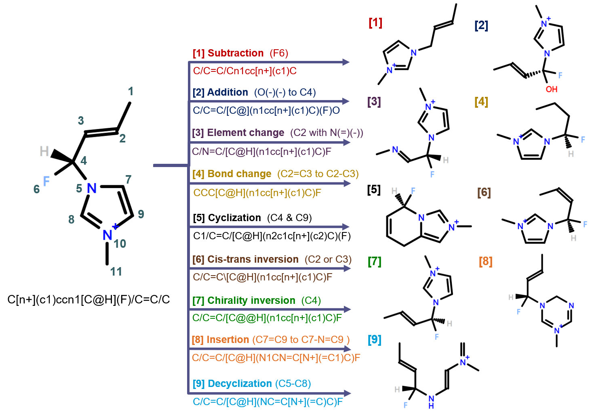

# MARS+: Molecular Assembly and Representation Suite - Plus

## MARS: the prototype

In computer-aided molecular design (CAMD) [1][2], the capability of generating new molecular species from existing one is vital. 
[MARS program](https://github.com/hsuhsuanhao/MARS) [3], devised for such demand, consists of two components: 

* **Molecular data structure (MDS)** : base elements and 5 arrays of integers
* **Genetic operators**              : ring formation, addition, subtraction, exchange, crossover, and combination

To initiate a MARS task, one should input the 3D structures of starting molecules. 
These structures will then be converted into MDS representation, where a structure is recognized as a network of base elements. 
Each of the genetic operators will be applied to each of the possible substructures in each of the MDSs. 
As a result, a number of new species can be generated.  

## MARS+: what is new in it?

MARS+ is based on MARS [3], with various improvements:

1. **The expansion of base element library**

        1-1. Group-like elements are allowed.
        1-2. Cationic cores and anionic cores are included.
		1-3. The library is not hard-coded. 
		     It can be appended easily. (See the instructions in inputs/element_lists/element_list.txt)

2. **The generalization of MDS**

		2-1. An additional array of integers is used to bookkeep optical isomerisms.
		2-2. Two additional arrays of integers are used to bookkeep cis-trans isomerisms.
		2-3. An additional array of integers is used to bookkeep cyclic bonds.
		2-4. Multiple ring numbers on an atom are allowed.
		2-5. The representation of a two-component chemical is allowed. 
		     Equimolar ionic liquids (1:1) are taken as examples.

3. **The generalization of genetic operators**

		3-1. Refinement of old operators:
			 3-1-1. The feasibility of molecular connectivity is ensured after subtraction operation.
			 3-1-2. Multiple ring numbers on an atom can be induced through cyclization operator.
			 3-1-3. For most of the operators, the codes are revised for better systematicness.
			        Unnecessary dependencies among variables are reduced.
			 3-1-4. The stability and flexibility of operators are enhanced. 
		3-2. Development of new operators: insertion, decyclization, element change, cis-trans inversion, chirality inversion, and component switch.
		3-3. Since the new operator scheme has a better reversibility, undoing an operation is much easier now. 
	         This can reduce unintended biases toward the generation of certain molecules (e.g. polycyclics).
		3-4. Check isomerisms of substructures after an operation is successfully conducted.
		     Assign default isomerisms (i.e. trans and clockwise winding) to potentially isomeric substructures.
		3-5. If an imine-like substructure is present, indicate the lone pair of nitrogen atom by a null atom "*".

4. **Wrapping some Open Babel [4] functions into MARS+**

		4-1. This facilitates the inputting of starting structures to the program. 
		     One only needs to input SMILES now.
		4-2. The isomerism perception for inputted molecules is more robust.

## Development environment

* Linux CentOS 6.3 (x86_64)
* Miniconda3 v4.9.2 (x86_64, py39)
* GNU g++ compiler v9.2.0 (C++11)
* Open Babel v3.1.0
* Eigen v3.3.7 
* Cmake v3.15.5
* Make v4.2

## Compiling MARS+ from source code

The MARS+ source code consists of 7 header files and 7 cpp files: (see `src/` directory)

    ELEMENTS.h    MOLECULE.h    CASES_NEU.h    CASES_IL_INDEPENDENT.h    CASES_IL.h    UTILITY.h    PARAMETER.h
    ELEMENTS.cpp  MOLECULE.cpp  CASES_NEU.cpp  CASES_IL_INDEPENDENT.cpp  CASES_IL.cpp  UTILITY.cpp  main.cpp

### For Linux users:
    
Before compiling MARS+, relevant softwares should be installed. 
With [Miniconda](https://docs.conda.io/en/latest/miniconda.html) or [Anaconda](https://www.anaconda.com/download), 
one can directly import `MARS+` environment along with the required packages from `MARS+_env.yml` or `MARS+_env_pipcmake.yml`. 

    conda env create --file MARS+_env_pipcmake.yml
 
(Note: `conda` may lead to a corrupted installation of `cmake`. 
Therefore, we provided an alternative `MARS+_env_pipcmake.yml`, which installs `cmake` from `pip`.)	
Now activate `MARS+` environment and compile the source code. 

    conda activate MARS+
    cd src/
    rm -r ./Makefile ./cmake_install.cmake ./CMakeCache.txt ./CMakeFiles 2> /dev/null
    cmake ./CMakeLists.txt
    make -j [N]                 ("-j [N]" is optional. It means parallel compiling with N jobs at once.)

An executable `MARS-PLUS` will be generated in `src/`.
Make sure the compiling is successful before launching MARS+ tasks, especially when you have made modifications to the code.

### For Windows users:

Please refer to the repository of [MARS+ Windows version](https://github.com/renan991995/MARS-PLUS-Wins).

## Usage

There are 3 input files for MARS+: (see `inputs/`)
        
    inputs/control.in                     : controls the input, output, and calculation options.
    inputs/element_lists/element_list.txt : a list that defines base element library.
    inputs/INPUT_CHEMICALS/IL4.txt        : the starting chemicals.
    
Please read the instructions in `inputs/control.in` and `inputs/element_lists/element_list.txt`.
Make sure you have properly set the parameters, and then launch the MARS+.

### For Linux users:

	cd src/
	./MARS-PLUS ../inputs/control.in

Alternatively, you may use the PBS scheduler. A PBS template `src/job.sh` is provided.

	cd src/
	qsub ./job.sh

The results for each of the operations will be outputted to `logs/`.
For instance, the generated chemicals by applying bond change operation to an IL will be written to `logs/change_bnd_IL.txt`.

### For Windows users:

Please refer to the repository of [MARS+ Windows version](https://github.com/renan991995/MARS-PLUS-Wins).

## Developers

Chen-Hsuan Huang (f07524028@ntu.edu.tw) and Shiang-Tai Lin (stlin@ntu.edu.tw).

Department of Chemical Engineering, National Taiwan University, Taipei, Taiwan

## References

[1] Austin, N. D.; Sahinidis, N. V.; Trahan, D. W., Computer-aided molecular design: An introduction and review of tools, applications, and solution techniques. Chem. Eng. Res. Des. 2016, 116, 2-26.

[2] Hsu, H. H.; Huang, C. H.; Lin, S. T., Fully Automated Molecular Design with Atomic Resolution for Desired Thermophysical Properties. Ind. Eng. Chem. Res. 2018, 57, (29), 9683-9692.

[3] Hsu, H.-H.; Huang, C.-H.; Lin, S.-T., New Data Structure for Computational Molecular Design with Atomic or Fragment Resolution. J. Chem. Inf. Model. 2019, 59, (9), 3703-3713.
(https://github.com/hsuhsuanhao/MARS)

[4] O’Boyle, N. M.; Banck, M.; James, C. A.; Morley, C.; Vandermeersch, T.; Hutchison, G. R., Open Babel: An open chemical toolbox. J. Cheminf. 2011. 
(https://github.com/openbabel/openbabel)

## MARS+: default base elements

* Neutral elements

| ID   | Name                         | Bond order | charge |
| ---- | ---------------------------- | ---------- | ------ |
| 1    | \[CH0\](-)(-)(-)(-)          | 1 1 1 1    | 0      |
| 2    | C(=)(-)(-)                   | 2 1 1      | 0      |
| 3    | C(#)(-)                      | 3 1        | 0      |
| 4    | C(=)(=)                      | 2 2        | 0      |
| 5    | O(-)(-)                      | 1 1        | 0      |
| 6    | O(=)                         | 2          | 0      |
| 7    | N(-)(-)(-)                   | 1 1 1      | 0      |
| 8    | N(=)(-)                      | 2 1        | 0      |
| 9    | N(#)                         | 3          | 0      |
| 10   | O(-)                         | 1          | 0      |
| 11   | F(-)                         | 1          | 0      |
| 12   | Cl(-)                        | 1          | 0      |
| 13   | Br(-)                        | 1          | 0      |
| 14   | I(-)                         | 1          | 0      |
| 19   | S(-)(-)                      | 1 1        | 0      |
| 20   | S(=)                         | 2          | 0      |
| 21   | P(-)(-)(-)                   | 1 1 1      | 0      |
| 22   | P(=)(-)                      | 2 1        | 0      |
| 23   | P(#)                         | 3          | 0      |
| 31   | \[PH0\](-)(-)(-)(-)(-)       | 1 1 1 1 1  | 0      |
| 32   | \[PH0\](=)(-)(-)(-)          | 2 1 1 1    | 0      |
| 34   | S(=)(-)(-)                   | 1 1        | 0      |
| 61   | \[SH0\](=)(=)(-)(-)          | 2 2 1 1    | 0      |
| 62   | Cl(=)(=)(=)(-)               | 2 2 2 1    | 0      |
| 66   | P(=)(-)(-)                   | 2 1 1      | 0      |
| 67   | \[CH0@@\](-)(-)(-)(-)        | 1 1 1 1    | 0      |
| 68   | \[CH0@\](-)(-)(-)(-)         | 1 1 1 1    | 0      |
| 69   | \[PH0\](-)(-)(-)(-)          | 1 1 1 1    | 0      |
| 70   | *(-)                         | 1          | 0      |

* Cationic elements

| ID   |        Name                              | Bond order | charge |
| ---- | ---------------------------------------- | ---------- | ------ |
| 15   | \[NH0+\](-)(-)(-)(-)                     | 1 1 1 1    | 1      |
| 16   | \[NH0+\](=)(-)(-)                        | 2 1 1      | 1      |
| 17   | \[PH0+\](-)(-)(-)(-)                     | 1 1 1 1    | 1      |
| 18   | \[PH0+\](=)(-)(-)                        | 2 1 1      | 1      |
| 36   | \[CH0\](-)(-)(-)(\[N+\]1C=CN(C)C=1)      | 1 1 1      | 1      |
| 37   | \[CH0\](-)(-)(-)(\[N+\]1C=CN(C)C(C)=1)   | 1 1 1      | 1      |
| 38   | \[CH0\](-)(-)(-)(N1C=C\[N+\](C)=C1)      | 1 1 1      | 1      |
| 39   | \[CH0\](-)(-)(-)(\[N+\]1=CC=CC(C)=C1)    | 1 1 1      | 1      |
| 40   | \[CH0\](-)(-)(-)(C1=C\[N+\](C)=CC=C1)    | 1 1 1      | 1      |
| 41   | C(-)(1=\[NH+\]C=CC=C1)                   | 1          | 1      |
| 42   | \[NH0+\](-)(1=CC=CC=C1)                  | 1          | 1      |
| 57   | \[In+3\](-)(-)(-)(-)                     | 1 1 1 1    | 3      |
| 64   | \[Ga+3\](-)(-)(-)(-)                     | 1 1 1 1    | 3      |
| 65   | \[SH0+\](-)(-)(-)                        | 1 1 1      | 1      |

* Anionic elements

| ID   |        Name                                                                     |   Bond order  | charge |
| ---- | ------------------------------------------------------------------------------- | ------------- | ------ |
| 24   | \[F-\]                                                                          | 0             | -1     |
| 25   | \[Cl-\]                                                                         | 0             | -1     |
| 26   | \[Br-\]                                                                         | 0             | -1     |
| 27   | \[I-\]                                                                          | 0             | -1     |
| 28   | \[OH1-\]                                                                        | 0             | -1     |
| 29   | \[OH0-\](-)                                                                     | 1             | -1     |
| 30   | \[PH0-\](-)(-)(-)(-)(-)(-)                                                      | 1 1 1 1 1 1   | -1     |
| 33   | S(-)(=O)(=O)(\[O-\])                                                            | 1             | -1     |
| 35   | \[NH0-\](-)(-)                                                                  | 1 1           | -1     |
| 43   | \[NH0-\](S(=O)(=O)C(F)(F)(F))(S(=O)(=O)C(F)(F)(F))                              | 0             | -1     |
| 44   | \[BH0-\](-)(-)(-)(-)                                                            | 1 1 1 1       | -1     |
| 45   | C(-)(-)(-)(C(=O)(\[O-\]))                                                       | 1 1 1         | -1     |
| 46   | C(#N)(\[S-\])                                                                   | 0             | -1     |
| 47   | C(-)(-)(-)(OP(=O)(OC)(\[O-\]))                                                  | 1 1 1         | -1     |
| 48   | C(#N)(\[N-\]C#N)                                                                | 0             | -1     |
| 49   | \[BH0-\](C#N)(C#N)(C#N)(C#N)                                                    | 0             | -1     |
| 50   | S(OCCOCCOC)(=O)(=O)(\[O-\])                                                     | 0             | -1     |
| 51   | S(c(cc1)ccc1C)(=O)(=O)(\[O-\])                                                  | 0             | -1     |
| 52   | \[PH0-\](F)(F)(F)(C(C(F)(F)F)(F)F)(C(C(F)(F)F)(F)F)(C(C(F)(F)F)(F)F)            | 0             | -1     |
| 53   | \[NH0-\](S(=O)(=O)C(C(F)(F)F)(F)F)(S(=O)(=O)C(C(F)(F)F)(F)F)                    | 0             | -1     |
| 54   | \[CH0-\](S(C(F)(F)(F))(=O)(=O))(S(C(F)(F)(F))(=O)(=O))(S(C(F)(F)(F))(=O)(=O))   | 0             | -1     |
| 55   | \[PH0-\](F)(F)(F)(F)(F)(F)                                                      | 0             | -1     |
| 56   | \[In+3\](\[Cl-\])(\[Cl-\])(\[Cl-\])(\[Cl-\])                                    | 0             | -1     |
| 58   | Cl(=O)(=O)(\[O-\])(=O)                                                          | 0             | -1     |
| 59   | \[CH0-\](-)(-)(-)                                                               | 1 1 1         | -1     |
| 60   | \[NH0+\](=O)(\[O-\])(\[O-\])                                                    | 0             | -1     |
| 63   | \[SH0-\](-)                                                                     | 1             | -1     |

## MARS+: molecular data structure (MDS)

## MARS+: genetic operators

* Uni-molecular operations - addition, insertion, subtraction, element change, bond change, cyclization, decyclization, cis-trans inversion, and chirality inversion:

* Bi-molecular operations - crossover:

* Bi-molecular operations - combination:

* Bi-supermolecular operation - component switch:

## Iterative molecular design

MARS+ supports the iterative molecular. 
It can be done by subjecting the molecules generated in a round to next round of exhaustive operations.
A dataset obtained in this way is provided in [IterDesignData repository](https://github.com/renan991995/MARS-PLUS-IterDesignData).

